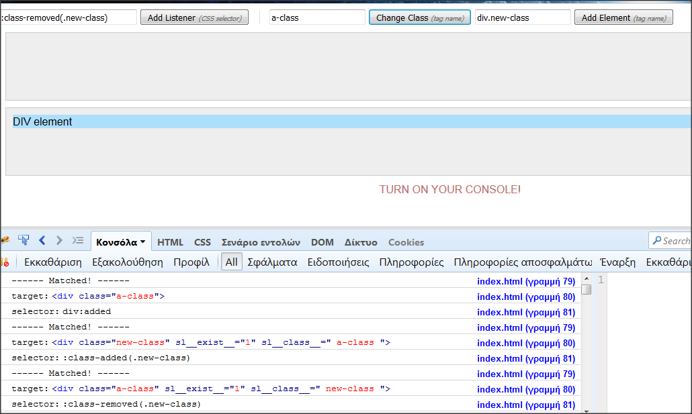

SelectorListener
================

Provides the following document/element methods to enable listening for CSS selector rule matches:


**note** `this` reference inside callbacks reference the matched element (i.e `event.target`) and **not** the element the listener is attached to (similar to `jQuery` use)


###The Basics###

```javascript

var oneTwoThree = function(){
  alert('Listening for complex element sequences is easy as 1, 2, 3!');
};

document.addSelectorListener('.one + .two + .three', oneTwoThree);

document.removeSelectorListener('.one + .two + .three', oneTwoThree);

/* Also available on elements: */

document.getElementById('foo').addSelectorListener('.one + .two + .three', oneTwoThree);

document.getElementById('foo').removeSelectorListener('.one + .two + .three', oneTwoThree);

```

###Now let's get fancy:###

```javascript

// Listening for attribute value matches? Child's play.
document.addSelectorListener('.foo[bar="boom"]', function(){ ... });

// Matching elements on hashchange can be annoying, let's make it stupid simple
document.addSelectorListener('*:target', function(event){
  alert('The hash-targeted element is:' + event.target);
});

// How about a more performant way to listen for custom tooltip nodes document wide?
document.addSelectorListener('.tooltip:hover', function(){ ... });


/*** Now that we have the new CSS 4 Selector spec, let's see what we can do: ***/

// Working with HTML5 sliders just got even easier
document.querySelector('#RandomForm').addSelectorListener('slider:out-of-range', function(){
  alert('Your slider value is now out of range! Oh noes!');
});

```

###Select only newly added and/or already existing elements (DOM mutation-like events):###

```javascript

document.addSelectorListener('.foo[bar="boom"]::added', function(){ ... });

// this also works
document.addSelectorListener('.foo[bar="boom"]:not(::exists)', function(){ ... });


document.addSelectorListener('*:exists:target', function(){ ... });

```

###Select elements which have their css-class changed (either a css class added or removed) (DOM mutation-like events):###

```javascript

document.addSelectorListener('.foo[bar="boom"]::class-added(.a-class)', function(){ ... });

document.addSelectorListener('.foo[bar="boom"]::class-removed(.a-class)', function(){ ... });

```

###Select only existing elements that have been removed (DOM mutation-like events, experimental):###

```javascript

document.addSelectorListener('.foo[bar="boom"]::removed', function(){ ... });

```

(see `index.html`)




###Browser Support (tested)###

1. Firefox 40+
2. Chrome 41+
3. Opera 34+
4. IE 11+
